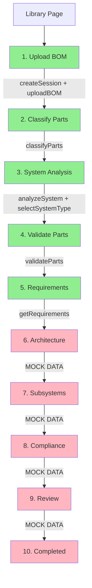
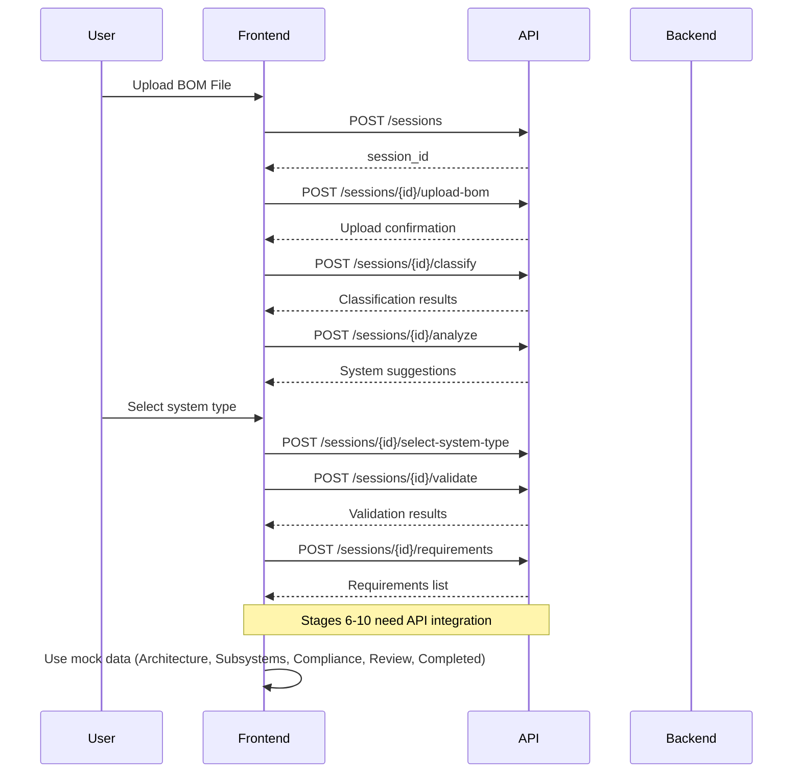

# BOM Evolution Platform - Complete Flow Documentation

## Overview

This document provides a complete breakdown of the BOM Evolution Platform workflow, from initial BOM upload through final completion. It identifies implemented features, missing integrations, and provides recommendations for completing the implementation.

## Complete Workflow Flow



**Legend:**

- 🟢 Green = Fully Implemented with API
- 🔴 Pink = Using Mock Data (Needs Implementation)

## Stage-by-Stage Breakdown

### Stage 1: Upload BOM ✅ IMPLEMENTED

**Location:** `src/app/pages/upload/`

**API Endpoints Used:**

- `POST /api/sessions` - Creates new session
- `POST /api/sessions/{session_id}/upload-bom` - Uploads BOM file

**Implementation Status:** ✅ Complete

- Session creation integrated
- File upload with FormData
- Session ID stored in context
- Navigation to classification stage

**Files:**

- `src/app/pages/upload/UploadPage.tsx`
- `src/app/pages/upload/components/UploadView.tsx`
- `src/app/services/api.ts` (createSession, uploadBOM)

---

### Stage 2: Classify Parts ✅ IMPLEMENTED

**Location:** `src/app/pages/fundamental/`

**API Endpoints Used:**

- `POST /api/sessions/{session_id}/classify` - Classifies parts as auxiliary/non-auxiliary

**Implementation Status:** ✅ Complete

- Automatic classification on page load
- Displays fundamental vs auxiliary components
- Allows manual reclassification
- Progress indicators and error handling

**Files:**

- `src/app/pages/fundamental/FundamentalPage.tsx`
- `src/app/pages/fundamental/components/FundamentalClassificationView.tsx`
- `src/app/services/api.ts` (classifyParts)

---

### Stage 3: System Analysis ✅ IMPLEMENTED

**Location:** `src/app/pages/analysis/`

**API Endpoints Used:**

- `POST /api/sessions/{session_id}/analyze` - Analyzes system and suggests types
- `POST /api/sessions/{session_id}/select-system-type` - Selects system type

**Implementation Status:** ✅ Complete

- Fetches AI-generated system type suggestions
- Displays confidence levels, architectural clues, and reasoning
- User selection and confirmation
- Navigation to validation stage

**Files:**

- `src/app/pages/analysis/AnalysisPage.tsx`
- `src/app/pages/analysis/components/AnalysisView.tsx`
- `src/app/services/api.ts` (analyzeSystem, selectSystemType)

---

### Stage 4: Validate Parts ✅ IMPLEMENTED

**Location:** `src/app/pages/validate/`

**API Endpoints Used:**

- `POST /api/sessions/{session_id}/validate` - Validates parts against databases

**Implementation Status:** ✅ Complete

- Automatic validation on page load
- Displays valid/invalid parts with confidence scores
- Shows suggestions for invalid parts
- Search and filter functionality
- Navigation to requirements stage

**Files:**

- `src/app/pages/validate/validatePage.tsx`
- `src/app/pages/validate/components/validationView.tsx`
- `src/app/services/api.ts` (validateParts)

---

### Stage 5: Requirements ✅ IMPLEMENTED

**Location:** `src/app/pages/requirements/`

**API Endpoints Used:**

- `POST /api/sessions/{session_id}/requirements` - Fetches generated requirements

**Implementation Status:** ✅ Complete

- Fetches requirements from API
- Displays by category with approval workflow
- Allows editing and custom requirement creation
- Mandatory approval before proceeding
- Navigation to architecture stage

**Files:**

- `src/app/pages/requirements/RequirementsPage.tsx`
- `src/app/pages/requirements/components/RequirementsView.tsx`
- `src/app/services/api.ts` (getRequirements)

---

### Stage 6: Architecture ❌ USING MOCK DATA

**Location:** `src/app/pages/architecture/`

**API Endpoints Used:** ❌ None (using mockComponents)

**Implementation Status:** ⚠️ Needs API Integration

- Currently uses `mockComponents` from `src/app/data/mockData.ts`
- Architecture canvas visualization exists
- Component positioning and relationships displayed
- No API call to generate/retrieve architecture

**Missing Implementation:**

- API endpoint to generate system architecture from classified components
- API endpoint to retrieve existing architecture for session
- API endpoint to save/update architecture layout

**Files:**

- `src/app/pages/architecture/ArchitecturePage.tsx`
- `src/app/pages/architecture/components/SystemArchitectureView.tsx`

**Recommended API Endpoints:**

```typescript
// Generate architecture
POST /api/sessions/{session_id}/architecture/generate

// Get architecture
GET /api/sessions/{session_id}/architecture

// Update architecture layout
PUT /api/sessions/{session_id}/architecture
```

---

### Stage 7: Subsystems ❌ USING MOCK DATA

**Location:** `src/app/pages/subsystems/`

**API Endpoints Used:** ❌ None (using mockSession.subsystems, mockComponents, mockSession.requirements)

**Implementation Status:** ⚠️ Needs API Integration

- Currently uses mock data for subsystems, components, and requirements
- Subsystem identification and grouping UI exists
- Component-to-subsystem assignment interface
- No API integration

**Missing Implementation:**

- API endpoint to generate subsystems from architecture and requirements
- API endpoint to retrieve subsystems for session
- API endpoint to update subsystem assignments

**Files:**

- `src/app/pages/subsystems/SubsystemsPage.tsx`
- `src/app/pages/subsystems/components/SubsystemsView.tsx`

**Recommended API Endpoints:**

```typescript
// Generate subsystems
POST /api/sessions/{session_id}/subsystems/generate

// Get subsystems
GET /api/sessions/{session_id}/subsystems

// Update subsystem assignments
PUT /api/sessions/{session_id}/subsystems
```

---

### Stage 8: Compliance ❌ USING MOCK DATA

**Location:** `src/app/pages/compliance/`

**API Endpoints Used:** ❌ None (using mockSession data)

**Implementation Status:** ⚠️ Needs API Integration

- Currently uses mock compliance scores and component statuses
- Compliance flow visualization exists
- Component compliance status display
- No API integration for compliance analysis

**Missing Implementation:**

- API endpoint to run compliance analysis against requirements
- API endpoint to get compliance results for session
- API endpoint to get component compliance statuses

**Files:**

- `src/app/pages/compliance/CompliancePage.tsx`
- `src/app/pages/compliance/components/ComplianceFlowView.tsx`

**Recommended API Endpoints:**

```typescript
// Run compliance analysis
POST /api/sessions/{session_id}/compliance/analyze

// Get compliance results
GET /api/sessions/{session_id}/compliance

// Get component compliance details
GET /api/sessions/{session_id}/compliance/components/{component_id}
```

---

### Stage 9: Review ❌ USING MOCK DATA

**Location:** `src/app/pages/review/`

**API Endpoints Used:** ❌ None (using mockSession)

**Implementation Status:** ⚠️ Needs API Integration

- Currently uses mockSession for all review data
- Review summary and stage navigation exists
- Final submission button exists
- No API integration to fetch session state or submit

**Missing Implementation:**

- API endpoint to get complete session state for review
- API endpoint to submit/finalize session
- API endpoint to export results

**Files:**

- `src/app/pages/review/ReviewPage.tsx`
- `src/app/pages/review/components/ReviewStage.tsx`

**Recommended API Endpoints:**

```typescript
// Get complete session state
GET /api/sessions/{session_id}

// Submit/finalize session
POST /api/sessions/{session_id}/submit

// Export results
GET /api/sessions/{session_id}/export
```

---

### Stage 10: Completed ❌ USING MOCK DATA

**Location:** `src/app/pages/completed/`

**API Endpoints Used:** ❌ None (using mockSession)

**Implementation Status:** ⚠️ Needs API Integration

- Currently uses mockSession for completed view
- Final summary and results display exists
- No API integration to fetch completed session data

**Missing Implementation:**

- API endpoint to get completed session details
- API endpoint to download/export final results

**Files:**

- `src/app/pages/completed/CompletedPage.tsx`
- `src/app/pages/completed/components/CompletedBOMView.tsx`

**Recommended API Endpoints:**

```typescript
// Get completed session
GET /api/sessions/{session_id}

// Download results
GET /api/sessions/{session_id}/download
```

---

## Implementation Summary

### ✅ Fully Implemented (5/10 stages)

1. Upload BOM
2. Classify Parts
3. System Analysis
4. Validate Parts
5. Requirements

### ⚠️ Needs Implementation (5/10 stages)

6. Architecture
7. Subsystems
8. Compliance
9. Review
10. Completed

---

## API Integration Checklist

### Current API Functions (in `src/app/services/api.ts`)

- ✅ `createSession()`
- ✅ `uploadBOM()`
- ✅ `classifyParts()`
- ✅ `analyzeSystem()`
- ✅ `selectSystemType()`
- ✅ `validateParts()`
- ✅ `getRequirements()`

### Missing API Functions Needed

- ❌ `getArchitecture()` / `generateArchitecture()`
- ❌ `getSubsystems()` / `generateSubsystems()`
- ❌ `getCompliance()` / `analyzeCompliance()`
- ❌ `getSessionState()` / `getSession()`
- ❌ `submitSession()`
- ❌ `exportSession()`

---

## Next Steps for Implementation

### Priority 1: Architecture Stage

1. Check API docs at https://designevolution-production.up.railway.app/api/docs#/ for architecture endpoints
2. If endpoints exist, add functions to `api.ts`
3. Update `ArchitecturePage.tsx` to fetch from API instead of mock data
4. Add loading states and error handling

### Priority 2: Subsystems Stage

1. Check API docs for subsystems endpoints
2. Add API functions for subsystems
3. Update `SubsystemsPage.tsx` to use real API data
4. Implement subsystem assignment updates

### Priority 3: Compliance Stage

1. Check API docs for compliance endpoints
2. Add compliance analysis API functions
3. Update `CompliancePage.tsx` to fetch compliance results
4. Display real compliance scores and failures

### Priority 4: Review & Completed Stages

1. Add `getSessionState()` function to fetch complete session
2. Update `ReviewPage.tsx` to use real session data
3. Add `submitSession()` function
4. Update `CompletedPage.tsx` to fetch completed session data
5. Add export/download functionality

---

## Data Flow Diagram



---

## Files Reference

### Core Files

- `src/app/App.tsx` - Main routing configuration
- `src/app/types.ts` - TypeScript type definitions
- `src/app/services/api.ts` - API service functions
- `src/app/context/SessionContext.tsx` - Session state management

### Page Components

- `src/app/pages/upload/` - Upload stage ✅
- `src/app/pages/fundamental/` - Classification stage ✅
- `src/app/pages/analysis/` - Analysis stage ✅
- `src/app/pages/validate/` - Validation stage ✅
- `src/app/pages/requirements/` - Requirements stage ✅
- `src/app/pages/architecture/` - Architecture stage ❌
- `src/app/pages/subsystems/` - Subsystems stage ❌
- `src/app/pages/compliance/` - Compliance stage ❌
- `src/app/pages/review/` - Review stage ❌
- `src/app/pages/completed/` - Completed stage ❌

### Shared Components

- `src/app/shared/components/Layout.tsx` - Main layout with stage indicator
- `src/app/shared/components/StageIndicator.tsx` - Stage navigation component

---

## Recommendations

1. **Check API Documentation First**: Visit https://designevolution-production.up.railway.app/api/docs#/ to verify which endpoints are actually available before implementing.

2. **Incremental Implementation**: Implement one stage at a time, starting with Architecture, then Subsystems, Compliance, and finally Review/Completed.

3. **Error Handling**: Ensure all new API integrations include proper error handling and loading states.

4. **Type Safety**: Update TypeScript types in `src/app/types.ts` to match API response structures.

5. **Session State Management**: Consider adding session state persistence to allow users to resume incomplete sessions.

6. **Testing**: Test each stage thoroughly after API integration to ensure data flows correctly between stages.