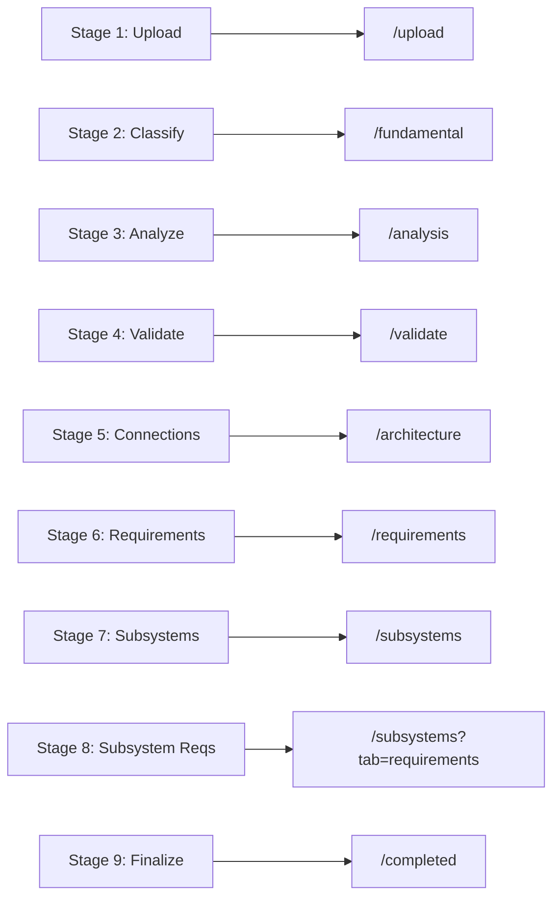
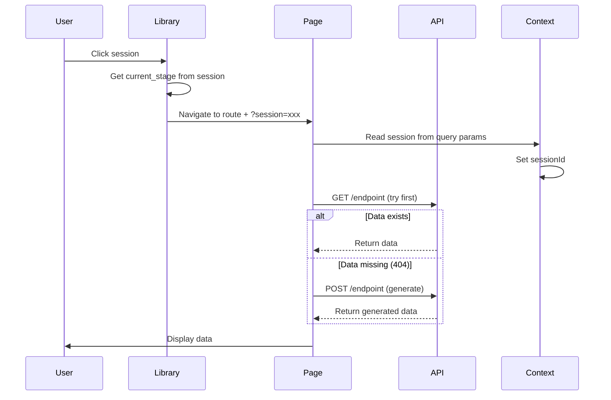

# Session-Based Navigation with Query Parameters and GET Endpoints

## Overview

Implement a complete session management system where:

- URLs include query parameters (`?session=xxx`) for shareable links
- Navigation routes users to the correct stage based on `current_stage` from API (determined from session data, not URL)
- Pages fetch existing data via GET endpoints, falling back to POST if data doesn't exist
- Focus on step 5 (Analyze Connections) implementation

## Stage-to-Route Mapping



## Implementation Plan

### 1. Query Parameter Infrastructure

**Files to modify:**

- `src/app/context/SessionContext.tsx` - Add query param sync
- `src/app/shared/hooks/useQueryParams.ts` - New hook for query param management
- `src/app/App.tsx` - Add query param initialization

**Changes:**

- Create `useQueryParams` hook to read/write `session` query param only
- Update `SessionContext` to sync with URL query params on mount
- Update URL when session changes
- Extract session ID from query params on page load
- Stage is determined from API `current_stage` field, not from URL

### 2. Stage-to-Route Navigation

**Files to modify:**

- `src/app/pages/library/LibraryPage.tsx` - Update navigation logic
- `src/app/shared/utils/navigation.ts` - New utility for stage routing

**Changes:**

- Create `getRouteForStage(stageNumber: number): string` function
- Map stages 1-9 to routes:
  - Stage 1 → `/upload`
  - Stage 2 → `/fundamental`
  - Stage 3 → `/analysis`
  - Stage 4 → `/validate`
  - Stage 5 → `/architecture`
  - Stage 6 → `/requirements`
  - Stage 7 → `/subsystems`
  - Stage 8 → `/subsystems?tab=requirements`
  - Stage 9 → `/completed`
- Update `handleSelectSession` to navigate with query params: `?session={sessionId}&step={stageNumber}`

### 3. GET Endpoints with POST Fallback

**Files to modify:**

- `src/app/services/api.ts` - Add GET endpoint functions

**New API functions:**

```typescript
// GET endpoints (try first)
getClassification(sessionId: string)
getSystemAnalysis(sessionId: string)
getValidationResults(sessionId: string)
getConnections(sessionId: string, bomId: string) // Step 5 focus
getRequirements(sessionId: string) // Already exists as POST, add GET
getSubsystems(sessionId: string)
getSubsystemRequirements(sessionId: string)

// Helper function pattern:
async function fetchOrGenerate<T>(
  getFn: () => Promise<T>,
  postFn: () => Promise<T>
): Promise<T>
```

**Implementation pattern:**

- Try GET endpoint first
- If 404/empty response, call POST endpoint
- Return data from either source

### 4. Step 5: Analyze Connections (Focus)

**Files to modify:**

- `src/app/services/api.ts` - Add `getConnections()` function
- `src/app/pages/architecture/ArchitecturePage.tsx` - Update to use GET with POST fallback

**Changes:**

- Add `getConnections(sessionId: string, bomId: string)` GET endpoint
- Update `ArchitecturePage` to:

  1. Try GET `/api/sessions/{session_id}/connections/{bom_id}` first
  2. If 404/empty, call POST `/api/sessions/{session_id}/analyze-connections`
  3. Use `sessionId` as `bomId` (they're the same in API response)
  4. Update URL with session query param on load

### 5. Update All Pages for Query Params

**Files to modify:**

- All page components in `src/app/pages/*/`

**Changes:**

- Each page should:

  1. Read `session` from query params on mount
  2. Set session ID in context from query params
  3. Update query params with session ID when navigating to next stage
  4. Use GET endpoints with POST fallback for data fetching
  5. Determine current stage from API response, not URL

**Pages to update:**

- `UploadPage.tsx` - Handle query params, skip if session exists
- `FundamentalPage.tsx` - GET `/classification`, fallback to POST `/classify`
- `AnalysisPage.tsx` - GET `/system-analysis`, fallback to POST `/analyze`
- `ValidatePage.tsx` - GET `/validation-results`, fallback to POST `/validate`
- `ArchitecturePage.tsx` - GET `/connections/{bom_id}`, fallback to POST `/analyze-connections` (Step 5)
- `RequirementsPage.tsx` - GET `/requirements`, fallback to POST `/requirements`
- `SubsystemsPage.tsx` - GET `/subsystems`, fallback to POST `/subsystems`
- `CompletedPage.tsx` - Handle final stage

### 6. Missing Pages (Future)

**New pages to create (when backend ready):**

- Subsystem Requirements page (Stage 8) - Can be integrated into `SubsystemsPage.tsx` with tab
- Finalize page (Stage 9) - May use existing `CompletedPage.tsx` or create new

## Data Flow



## Key Implementation Details

### Query Parameter Hook

```typescript
// src/app/shared/hooks/useQueryParams.ts
export function useQueryParams() {
  const [searchParams, setSearchParams] = useSearchParams();
  
  const sessionId = searchParams.get('session');
  
  const updateParams = (session?: string) => {
    const params = new URLSearchParams();
    if (session) params.set('session', session);
    setSearchParams(params);
  };
  
  return { sessionId, updateParams };
}
```

### GET with POST Fallback Pattern

```typescript
// Example for connections (Step 5)
const fetchConnections = async () => {
  try {
    // Try GET first
    const data = await getConnections(sessionId, sessionId);
    return data;
  } catch (error) {
    if (error.status === 404) {
      // Data doesn't exist, generate it
      return await analyzeConnections(sessionId);
    }
    throw error;
  }
};
```

## Testing Checklist

- [ ] Query param (session only) appears in URL when selecting session
- [ ] Session ID extracted from query params on page load
- [ ] Navigation updates session query param correctly
- [ ] Stage is determined from API current_stage, not URL
- [ ] GET endpoints called first, POST as fallback
- [ ] Step 5 (connections) works with GET endpoint
- [ ] Shareable links work (copy/paste URL)
- [ ] Direct navigation to stage works with query params

## Files Summary

**New files:**

- `src/app/shared/hooks/useQueryParams.ts`
- `src/app/shared/utils/navigation.ts`

**Modified files:**

- `src/app/context/SessionContext.tsx`
- `src/app/services/api.ts`
- `src/app/pages/library/LibraryPage.tsx`
- `src/app/pages/upload/UploadPage.tsx`
- `src/app/pages/fundamental/FundamentalPage.tsx`
- `src/app/pages/analysis/AnalysisPage.tsx`
- `src/app/pages/validate/validatePage.tsx`
- `src/app/pages/architecture/ArchitecturePage.tsx` (Step 5 focus)
- `src/app/pages/requirements/RequirementsPage.tsx`
- `src/app/pages/subsystems/SubsystemsPage.tsx`
- `src/app/App.tsx`