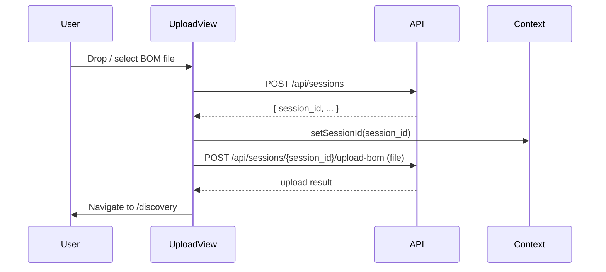

# Session Creation & BOM Upload Integration

## Overview

Introduce a real API layer and a React Context to hold `session_id` globally. Every time a user uploads a BOM, a **new session is created first**, then the file is uploaded to that session. The `session_id` persists in context for all downstream pages to use.

## Flow



## Key Files

| File | Action |

|------|--------|

| `src/app/services/api.ts` | New - API functions: `createSession()`, `uploadBOM()` |

| `src/app/context/SessionContext.tsx` | New - React Context holding `sessionId` |

| `src/app/App.tsx` | Wrap routes in `SessionProvider` |

| `src/app/pages/upload/components/UploadView.tsx` | Replace mock `setTimeout` with real API calls |

| `src/app/pages/upload/UploadPage.tsx` | Minor: pass session context forward if needed |

## Details

### 1. `src/app/services/api.ts`

```ts
const BASE_URL = 'https://designevolution-production.up.railway.app/api';

export async function createSession(): Promise<{ session_id: string }> { ... }
export async function uploadBOM(sessionId: string, file: File): Promise<any> { ... }
```

### 2. `src/app/context/SessionContext.tsx`

A simple `createContext` holding `sessionId: string | null` and a setter. Wrapped around the app in `App.tsx`.

### 3. `UploadView.tsx` — `processFile()` rewrite

```
1. call createSession()  → get session_id
2. call setSessionId(session_id) on context
3. call uploadBOM(session_id, file)
4. on success → call onUploadComplete()
```

Errors are surfaced via `toast.error`.